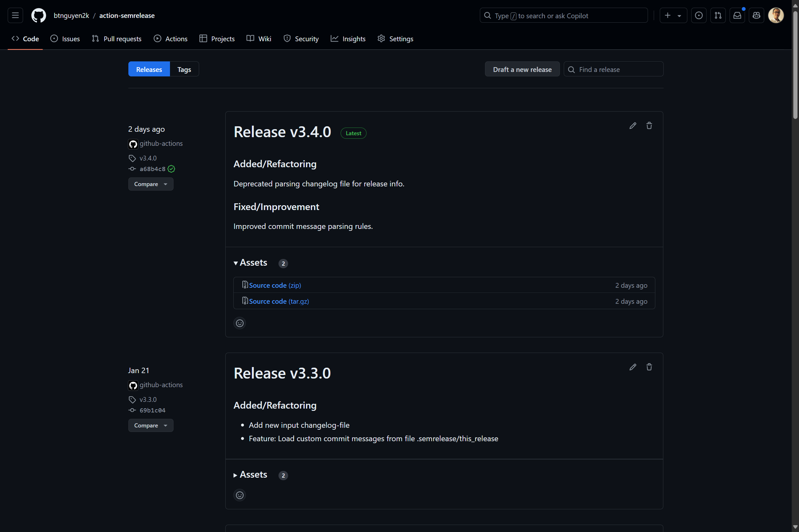

# SemRelease

[](RELEASE-NOTES.md)
[](https://github.com/btnguyen2k/action-semrelease/actions)
[](https://codecov.io/gh/btnguyen2k/action-semrelease)

GitHub Action to automatically create releases with tags, following [semantic versioning](https://semver.org/spec/v2.0.0.html) conventions.

## Usage

Use this Action as a step in your workflow file. For example:

```yaml
jobs:
  release:
    runs-on: ubuntu-latest
    outputs:
      RESULT: ${{ steps.release.outputs.result }}
      VERSION: ${{ steps.release.outputs.releaseVersion }}
      RELEASE_NOTES: ${{ steps.release.outputs.releaseNotes }}
    steps:
      - name: Checkout code
        uses: actions/checkout@v4
      - name: Install Node
        uses: actions/setup-node@v4
        with:
          node-version: 'lts/*'
      - name: Release
        id: release
        uses: btnguyen2k/action-semrelease@v3
        with:
          github-token: ${{ secrets.GITHUB_TOKEN }}

  post-release:
    runs-on: ubuntu-latest
    needs: [release]
    steps:
      - name: Print release result
        run: |
          RESULT='${{ needs.release.outputs.RESULT }}'
          VERSION='${{ needs.release.outputs.VERSION }}'
          RELEASE_NOTES='${{ needs.release.outputs.RELEASE_NOTES }}'
          echo "- RESULT: ${RESULT}"
          echo "- VERSION: ${VERSION}"
          echo "- RELEASE_NOTES: ${RELEASE_NOTES}"
```

## How it works

This Action analyzes commit messages to determine if a new release is needed, and if so, automatically calculates the next version number and creates a new release tag with release notes compiled from commit messages. The following screenshot illustrates the result:



> The version number follows [semantic versioning](https://semver.org/spec/v2.0.0.html) conventions. The tag name can have an optional prefix, for example `v` (e.g. `v1.2.3`).

### Versioning rules

A new major version is released when a breaking change is detected in commit messages.
A new minor version is released when new or deprecated features are detected.
A new patch version is released when only bug fixes or improvements/optimizations are detected.

The following regular expressions are used to detect breaking changes, new features, and bug fixes:

```regexp
A breaking change is detected if any of the following rules match:

/^[^a-z]*(break(ing)?\s+)?change([ds])?(\([^)]+\)\s*)?:?\s+/i
/^[^a-z]*\[(break(ing)?\s+)?change([ds])?]:?\s+/i
/^[^a-z]*\((break(ing)?\s+)?change([ds])?\):?\s+/i
/^[^a-z]*break(ing)?(\([^)]+\)\s*)?:?\s+/i
/^[^a-z]*\[break(ing)?]:?\s+/i
/^[^a-z]*\(break(ing)?\):?\s+/i
/^[^a-z]*rem(ov(e|ing|es|ed))?(\([^)]+\)\s*)?:?\s+/i
/^[^a-z]*\[rem(ov(e|ing|es|ed))?]:?\s+/i
/^[^a-z]*\(rem(ov(e|ing|es|ed))?\):?\s+/i
/^[^a-z]*.+(is|are|been)( now)? removed.*/i
/^[^a-z]*.+no longer (available|support(s|ed)?).*/i
/^[^a-z]*ren(am(e|ing|es|ed))?(\([^)]+\)\s*)?:?\s+/i
/^[^a-z]*\[ren(am(e|ing|es|ed))?]:?\s+/i
/^[^a-z]*\(ren(am(e|ing|es|ed))?\):?\s+/i
/^[^a-z]*repl(ac(e|ing|es|ed))?(\([^)]+\)\s*)?:?\s+/i
/^[^a-z]*\[repl(ac(e|ing|es|ed))?]:?\s+/i
/^[^a-z]*\(repl(ac(e|ing|es|ed))?\):?\s+/i
/^[^a-z]*redesign(ing|ed|s)?(\([^)]+\)\s*)?:?\s+/i
/^[^a-z]*\[redesign(ing|ed|s)?]:?\s+/i
/^[^a-z]*\(redesign(ing|ed|s)?\):?\s+/i

A new/deprecated feature is detected if any of the following rules match:

/^[^a-z]*depr(ecat(e|ing|ed|es))?(\([^)]+\)\s*)?:?\s+/i
/^[^a-z]*\[depr(ecat(e|ing|ed|es))?]:?\s+/i
/^[^a-z]*\(depr(ecat(e|ing|ed|es))?\):?\s+/i
/^[^a-z]*.+(is|are|been)( now)? deprecated.*/i
/^[^a-z]*refactor(ing|ed|s)?(\([^)]+\)\s*)?:?\s+/i
/^[^a-z]*\[refactor(ing|ed|s)?]:?\s+/i
/^[^a-z]*\(refactor(ing|ed|s)?\):?\s+/i
/^[^a-z]*.+(is|are|been)( now)? refactor(ed|ing).*/i
/^[^a-z]*add(ing|ed|s)?(\([^)]+\)\s*)?:?\s+/i
/^[^a-z]*\[add(ing|ed|s)?]:?\s+/i
/^[^a-z]*\(add(ing|ed|s)?\):?\s+/i
/^[^a-z]*(new\s+)?feat(ure(s)?)?(\([^)]+\)\s*)?:?\s+/i
/^[^a-z]*\[(new\s+)?feat(ure(s)?)?]:?\s+/i
/^[^a-z]*\((new\s+)?feat(ure(s)?)?\):?\s+/i

A bug fix/improvement/optimization is detected if any of the following rules match:

/^[^a-z]*fix(ing|ed|es)?(\([^)]+\)\s*)?:?\s+/i
/^[^a-z]*\[fix(ing|ed|es)?]:?\s+/i
/^[^a-z]*\(fix(ing|ed|es)?\):?\s+/i
/^[^a-z]*.+(is|are|been)( now)? fix(ed|ing).*/i
/^[^a-z]*patch(ing|ed|es)?(\([^)]+\)\s*)?:?\s+/i
/^[^a-z]*\[patch(ing|ed|es)?]:?\s+/i
/^[^a-z]*\(patch(ing|ed|es)?\):?\s+/i
/^[^a-z]*.+(is|are|been)( now)? patch(ed|ing).*/i
/^[^a-z]*impr(ov(ing|es|ed|ement)?)?(\([^)]+\)\s*)?:?\s+/i
/^[^a-z]*\[impr(ov(ing|es|ed|ement)?)?]:?\s+/i
/^[^a-z]*\(impr(ov(ing|es|ed|ement)?)?\):?\s+/i
/^[^a-z]*.+(is|are|been)( now)? improv(ed|ing).*/i
/^[^a-z]*optimiz(e|ing|ation|es|ed)(\([^)]+\)\s*)?:?\s+/i
/^[^a-z]*\[optimiz(e|ing|ation|es|ed)]:?\s+/i
/^[^a-z]*\(optimiz(e|ing|ation|es|ed)\):?\s+/i
/^[^a-z]*.+(is|are|been)( now)? optimiz(ed|ing).*/i
/^[^a-z]*perf(ormance)?(\([^)]+\)\s*)?:?\s+/i
/^[^a-z]*\[perf(ormance)?]:?\s+/i
/^[^a-z]*\(perf(ormance)?\):?\s+/i
/^[^a-z]*sec(urity)?(\([^)]+\)\s*)?:?\s+/i
/^[^a-z]*\[sec(urity)?]:?\s+/i
/^[^a-z]*\(sec(urity)?\):?\s+/i
/^[^a-z]*dep(endenc(y|ies))?(\([^)]+\)\s*)?:?\s+/i
/^[^a-z]*\[dep(endenc(y|ies))?]:?\s+/i
/^[^a-z]*\(dep(endenc(y|ies))?\):?\s+/i
```

The following table illustrates how commit messages are mapped to release versions:

| Sample commit message                                                    | Release version   |
|--------------------------------------------------------------------------|-------------------|
| [BREAKING CHANGE] Hash function parameter is no longer optional          | New major release |
| Renamed hash function from MD5 to md5Hash                                | New major release |
| Replaces function `GetRelease()` with `GetLatestRelease()`               | New major release |
| API `GetBranches()` is removed and no longer available                   | New major release |
|                                                                          |                   |
| Method `MD5` is now deprecated and will be removed in future versions    | New minor release |
| The class Hashing is refactored to use SHA256                            | New minor release |
| Added new hash function `HashUtils::hashSha1()`                          | New minor release |
| [New feature] scan commit messages to build new release                  | New minor release |
|                                                                          |                   |
| Fixed typo in function `HashUtils::hashMd5()`                            | New patch release |
| Patched: function `HashUtils::Crc32()` now returns correct value         | New patch release |
| perf(API) function `HashUtils::hashChain()` is now 100% faster           | New patch release |
| Dependency(Dev) - bump `krypto` to v1.2.3                                | New patch release |
| [SECURITY]: fix potential SQLi security vulnerability in class `DbUtils` | New patch release |
| Docker image size has been optimized, reduced by half                    | New patch release |

### Inputs and Outputs

Inputs are supplied via the `with` block. For example:

```yaml
uses: btnguyen2k/action-semrelease@v3
with:
  github-token: ${{ secrets.GITHUB_TOKEN }}
  dry-run: true
```

The following inputs are accepted:

| Input                         | Required | Default         | Description                                                                   |
|-------------------------------|----------|-----------------|-------------------------------------------------------------------------------|
| github-token                  | Yes      |                 | Either a PAT or GITHUB_TOKEN to access the repository.                        |
| dry-run                       | No       | `false`         | If `true`, the Action will run in dry-run mode.                               |
| tag-prefix                    | No       | `'v'`           | Prefix for release tags.                                                      |
| tag-major-release             | No       | `true`          | If `true`, a major release tag will be created, e.g. `v1`                     |
| tag-minor-release             | No       | `false`         | If `true`, a minor release tag will be created, e.g. `v1.2`                   |
| branches                      | No       | `'main,master'` | Comma-separated list of branches to scan for commit messages.                 |
| path                          | No       | `''`            | Scan and Analyze only commits containing this file path.                      |

> ⚠️ **Deprecation notice**: beginning with version [v3.4.0](RELEASE-NOTES.md), the `auto-mode` and `changelog-file` inputs are deprecated
> and will be removed in future releases.

This Action outputs the following:

| Output         | Description                                                                          |
|----------------|--------------------------------------------------------------------------------------|
| result         | The result of the Action's run. Possible values are `FAILED`, `SKIPPED`, `SUCCESS`.  |
| releaseVersion | The releasing version string, e.g. `1.2.3` (`tag-prefix` is not included!)           |
| releaseNotes   | The release notes.                                                                   |

## Customizing Version Numbers and Commit Messages

There may be scenarios where you want to customize the version number for a release. For instance, if the current version is `3.4.5` but you prefer the new release to be `6.0.0` instead of `3.4.6` or `3.5.0` or `4.0.0`. Additionally, since commit messages are used to compile the release notes, you might want to customize which commit messages are analyzed and included.

These customizations can be achieved by using the `.semrelease/this_release` file located in the repository's root directory. This file is a simple text file containing the following information:

```text
# Lines starting with '#' are comments and will be ignored.

Lines not starting with '#' are commit messages and will be used to analyze and compile the release notes.

- Each line should contain a single commit message only.

= Leading spaces and markers such as `-`, '=', `+`, etc. will be trimmed before analyzing the commit message.
```

If the `.semrelease/this_release` file does not exist or contains no commit messages, the Action will fallback to analyzing commit messages from the repository's commits.

### Pre-release preparation and Post-release cleanup

This action leaves the content of the `.semrelease/this_release` file unchanged after the release is created. The repository owner must manually clean up the file content. The following code snippet illustrates how to clean up the `.semrelease/this_release` file after a release is created:

```yaml
env:
  BRANCH_TO_RELEASE: 'release'
  TAG_PREFIX: 'v'

jobs:
  dryrun:
    # ...

  release:
    runs-on: ubuntu-latest
    if: |
      needs.dryrun.outputs.RESULT == 'SUCCESS'
    needs: [ dryrun ]
    outputs:
      # forward outputs to next jobs
      RESULT: ${{ steps.semrelease.outputs.result }}
      VERSION: ${{ steps.semrelease.outputs.releaseVersion }}
      RELEASE_NOTES: ${{ steps.semrelease.outputs.releaseNotes }}
    permissions:
      contents: write # to be able to publish a GitHub release and commit back to repo
    steps:
      - name: Checkout Code
        uses: actions/checkout@v4
      # ...
      # other preparation steps...
      # ...
      - name: SemRelease
        id: semrelease
        uses: btnguyen2k/action-semrelease@v4
        with:
          github-token: ${{ secrets.GITHUB_TOKEN }}
          branches: ${{ env.BRANCH_TO_RELEASE }}
          tag-prefix: ${{ env.TAG_PREFIX }}
      - name: Cleanup file .semrelease/this_release
        run: |
          RESULT='${{ steps.semrelease.outputs.result }}'
          if [ "${RESULT}" == "SUCCESS" ]; then
            VERSION='${{ steps.semrelease.outputs.releaseVersion }}'
            echo "🕘 Cleaning up file .semrelease/this_release..."
            echo "# This file has been cleaned up post-releasing version ${VERSION}." > .semrelease/this_release
            echo "# Generate its content quickly using the following command:" >> .semrelease/this_release
            echo "#   git log origin..HEAD | grep \"^\s\" > .semrelease/this_release" >> .semrelease/this_release
            git config --global user.email "<>"
            git config --global user.name "CI Build"
            git commit -am "Cleanup file .semrelease/this_release post releasing version ${VERSION}"
            git push -f
            echo "✅ Done."
          else
            echo "❎ SKIPPED."
          fi
```

Similarly, the repository owner may wish to update the content of the changelog file (e.g., `CHANGELOG.md`) before a release is created so that the changelog can be included in the release. The following code snippet illustrates how to prepare the `CHANGELOG.md` file for a release:

```yaml
env:
  BRANCH_TO_RELEASE: 'release'
  TAG_PREFIX: 'v'
  FILE_CHANGELOG: 'CHANGELOG.md'

jobs:
  dryrun:
    # ...

  release:
    runs-on: ubuntu-latest
    if: |
      needs.dryrun.outputs.RESULT == 'SUCCESS'
    needs: [ dryrun ]
    outputs:
      # forward outputs to next jobs
      RESULT: ${{ steps.semrelease.outputs.result }}
      VERSION: ${{ steps.semrelease.outputs.releaseVersion }}
      RELEASE_NOTES: ${{ steps.semrelease.outputs.releaseNotes }}
    permissions:
      contents: write # to be able to publish a GitHub release and commit back to repo
    steps:
      - name: Checkout Code
        uses: actions/checkout@v4
      # ...
      # other preparation steps...
      # ...
      - name: Update metadata
        run: |
          echo "🕘 Updating metadata..."
          DATE=`date +%Y-%m-%d`
          VERSION='${{ needs.dryrun.outputs.VERSION }}'
          RELEASE_NOTES='${{ needs.dryrun.outputs.RELEASE_NOTES }}'

          echo "🕘 Updating file ${{ env.FILE_CHANGELOG }}..."

          # save the first line of the change log file, which is usually the header
          head -1 ${{ env.FILE_CHANGELOG }} > .temp.md

          # append new version number, release date and release notes
          echo -e "\n## ${DATE} - ${{ env.TAG_PREFIX }}${VERSION}\n\n${RELEASE_NOTES}" >> .temp.md

          # append the existing content of the change log file
          # this way, the new version will be at the top of the change log
          tail -n +2 ${{ env.FILE_CHANGELOG }} >> .temp.md

          # replace the change log file with the new content
          mv -f .temp.md ${{ env.FILE_CHANGELOG }}

          echo "---------- content of ${{ env.FILE_CHANGELOG }} ----------"
          cat ${{ env.FILE_CHANGELOG }}

          # OPTIONAL: replace the placeholder <<VERSION>> in document/source files
          echo "🕘 Updating VERSION string in other files..."
          sed -i -E "s/<<VERSION>>/${{ env.TAG_PREFIX }}${VERSION}/" ./*.md
          sed -i -E "s/<<VERSION>>/${{ env.TAG_PREFIX }}${VERSION}/" ./src/*.js
          sed -i -E "s/<<VERSION>>/${{ env.TAG_PREFIX }}${VERSION}/" ./test/*.js

          echo "🕘 Committing metadata updates..."
          git config --global user.email "<>"
          git config --global user.name "CI Build"
          git commit -am "Update metadata for new version ${VERSION}"
          git push -f

          echo "✅ Done."
      - name: SemRelease
        id: semrelease
        # ...
```

## License

This project is licensed under the MIT License. See the [LICENSE.md](LICENSE.md) file for details.

## Support and Contribution

Feel free to create [pull requests](https://github.com/btnguyen2k/action-semrelease/pulls) or [issues](https://github.com/btnguyen2k/action-semrelease/issues) to report bugs or suggest new features.
Please search the existing issues before filing new ones to avoid duplicates. For new issues, file your bug or feature request as a new issue.

If you find this project useful, please start it.
